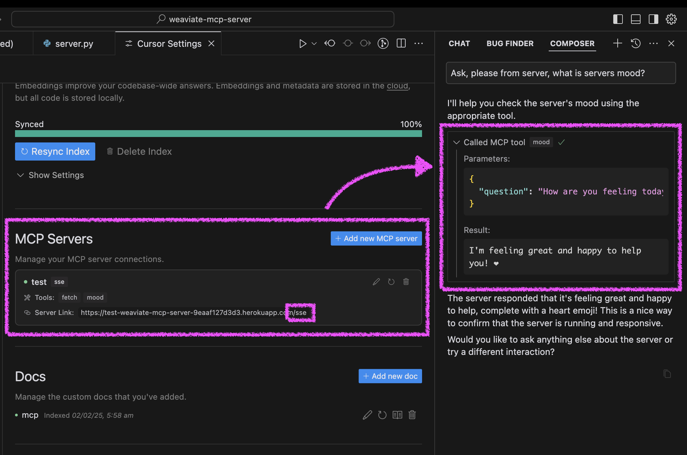

# MCP Server Template for Cursor IDE

A simple template for creating custom tools for Cursor IDE using Model Context Protocol (MCP). Create your own repository from this template, modify the tools, and connect them to your Cursor IDE.

## Quick Start

1. Click "Deploy to Heroku" button

    [](https://heroku.com/deploy?template=https://github.com/kirill-markin/weaviate-mcp-server)

2. After deployment, configure Cursor:
   - Open Cursor Settings → Features
   - Add new MCP server
   - Use your Heroku URL with `/sse` path (e.g., `https://your-app-name.herokuapp.com/sse`)

3. Test your agent's mood in Cursor:
   - Ask your agent "Please ask about our server mood and let me know how it is."
   - The server will respond with a cheerful message and a heart ❤️
   
   

## Requirements

- Python 3.10 or higher
- For development: uv package manager
- For production: Docker

## Usage

You can run the server in two ways: using traditional Python setup or using Docker.

### Traditional Setup

Start the server using either stdio (default) or SSE transport:

```bash
# Using stdio transport (default)
uv run mcp-simple-tool

# Using SSE transport on custom port
uv run mcp-simple-tool --transport sse --port 8000
```

### Docker Setup

The project includes Docker support for easy deployment:

1. Initial setup:
```bash
# Clone the repository
git clone https://github.com/kirill-markin/weaviate-mcp-server.git
cd weaviate-mcp-server

# Create environment file
cp .env.example .env
```

2. Build and run using Docker Compose:
```bash
# Build and start the server
docker compose up --build -d

# View logs
docker compose logs -f

# Check server status
docker compose ps

# Stop the server
docker compose down
```

3. The server will be available at:
   - SSE endpoint: http://localhost:8000/sse

4. Quick test:
```bash
# Test the server endpoint
curl -i http://localhost:8000/sse
```

### Environment Variables

Available environment variables (can be set in `.env`):

- `MCP_SERVER_PORT` (default: 8000) - Port to run the server on
- `MCP_SERVER_HOST` (default: 0.0.0.0) - Host to bind the server to
- `DEBUG` (default: false) - Enable debug mode
- `MCP_USER_AGENT` - Custom User-Agent for website fetching

## API Documentation

The server exposes a tool named "fetch" that accepts one required argument:

- `url`: The URL of the website to fetch

## Examples

### Using STDIO Transport (Python Client)

```python
import asyncio
from mcp.client.session import ClientSession
from mcp.client.stdio import StdioServerParameters, stdio_client


async def main():
    async with stdio_client(
        StdioServerParameters(command="uv", args=["run", "mcp-simple-tool"])
    ) as (read, write):
        async with ClientSession(read, write) as session:
            await session.initialize()

            # List available tools
            tools = await session.list_tools()
            print(tools)

            # Call the fetch tool
            result = await session.call_tool("fetch", {"url": "https://example.com"})
            print(result)


asyncio.run(main())
```

### Using SSE Transport (curl example)

```bash
# 1. Connect to SSE endpoint
curl -N http://localhost:8000/sse

# You'll receive a response with a session ID like:
# event: endpoint
# data: /messages/?session_id=<session_id>

# 2. Use the session ID to send commands
curl -X POST http://localhost:8000/messages/?session_id=<session_id> \
  -H "Content-Type: application/json" \
  -d '{"type": "call_tool", "name": "fetch", "arguments": {"url": "https://example.com"}}'
```

## Production Deployment

For production deployment:

1. Set up proper SSL/TLS termination (recommended: use Nginx as reverse proxy)
2. Configure appropriate security headers
3. Set up monitoring and logging
4. Consider rate limiting for public endpoints

### Docker Deployment Tips

1. Always use specific versions in production:
```bash
docker compose pull  # Get latest versions
docker compose up -d --build  # Rebuild with new versions
```

2. Monitor container health:
```bash
docker compose ps  # Check container status
docker compose logs -f  # Watch logs in real-time
```

## Health Checks

The Docker setup includes health checks that verify the server's availability every 30 seconds. You can monitor the health status using:

```bash
docker compose ps  # Check the 'Status' column
```

The health check:
- Runs every 30 seconds
- Verifies the SSE endpoint is responding
- Retries 3 times before marking as unhealthy
- Has a 10-second startup grace period

## Additional options

[](https://smithery.ai/server/@kirill-markin/example-mcp-server)
<a href="https://glama.ai/mcp/servers/jgisqn8zco"></a>

### Installing via Smithery

To install MCP Server Template for Cursor IDE for Claude Desktop automatically via [Smithery](https://smithery.ai/server/@kirill-markin/example-mcp-server):

```bash
npx -y @smithery/cli install @kirill-markin/example-mcp-server --client claude
```
